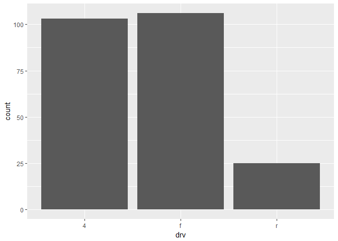

qplot()
================
2018-07-03

### qplot() 작동 원리와 히스토그램 계급 구간

`ggplot2` 패키지의 `qplot()`은 데이터의 특징을 간단하게 확인하기 위한 용도로 그래프를 생성할 때 주로 사용한다. `qplot()`에 적용한 변수의 특징이 무엇인지에 따라 그래프의 형태가 결정된다. `x`에 범주 변수를 지정하면 범주별 빈도를 표현한 막대 그래프를 생성한다.

``` r
library(ggplot2)
qplot(data = mpg, x = drv)
```



`x`에 연속 변수를 지정하면 **계급 구간별 빈도**를 표현한 히스토그램을 생성한다. 계급 구간 `bins`는 30개로 기본 설정되어있다.

``` r
qplot(data = mpg, x = hwy)
```

    ## `stat_bin()` using `bins = 30`. Pick better value with `binwidth`.


#### 계급 구간의 개수 지정하기

`stat_bin()` 함수의 `bins` 파라미터를 이용하면 계급 구간의 개수를 지정할 수 있다.

``` r
qplot(data = mpg, x = hwy) + stat_bin(bins = 10)
```


소수의 숫자로 구성된 연속 변수를 적용하더라도, 숫자의 범위에 관계 없이 계급 구간을 30개로 구성해 히스토그램을 생성한다

``` r
var <- c(1, 1, 2, 2, 3)
qplot(var)
```


지정된 계급 구간의 개수로 모든 값을 표현할 수 없으면, 계급 구간의 폭과 상한값에서 하한값 까지의 범위를 조정한다.

``` r
qplot(var) + stat_bin(bins = 5)
```


#### 연속 변수를 빈도 막대 그래프로 표현하기

`qplot()`에 연속 변수를 적용하면 히스토그램을 생성한다. 히스토그램이 아니라 각 값의 빈도를 표현한 **빈도 막대 그래프**를 생성하려면 `geom` 파라미터에 `"bar"`를 지정하면 된다.

``` r
qplot(var, geom = "bar")
```


연속 변수를 `as.factor()`를 이용해 범주 변수(factor)로 변경하거나 `as.character()`를 이용해 문자 변수로 변경해도 빈도 막대 그래프를 생성한다.

``` r
qplot(as.factor(var))
```


``` r
qplot(as.character(var))
```


